# Rationale of Latent-Space Oversampling: SMOTE for Low-Resource Emotion Classification

### *High-Dimensional Interpolation and Generalization Under Severe Class Imbalance*

[](https://www.python.org/)
[](https://pytorch.org/)
[](LICENSE)
[](https://huggingface.co/datasets/KSE-RESEARCH-Group/UAReviews)
[](https://huggingface.co/Qwen/Qwen3-Embedding-0.6B)
[](https://drive.google.com/drive/folders/195TJc0iXsjVrNvXVaJjSjJKEzOE7wQlT?usp=drive_link)

---

## 📖 Table of Contents

- [Executive Summary & Key Takeaways](#-executive-summary--key-takeaways)
- [Repository Structure & Pipeline](#-repository-structure--pipeline)
- [1. The Real-World Dilemma](#1-the-real-world-dilemma)
- [2. Existing Works](#2-existing-works)
- [3. What is Added](#3-what-is-added)
- [4. Data & Latent-Space Analysis](#4-data--latent-space-analysis)
  - [4.1 Data](#41-data)
  - [4.2 Latent-Space Representation](#42-latent-space-representation)
  - [4.3 Similarity and Class Purity](#43-similarity-and-class-purity)
  - [4.4 Tail Class Margin Distribution](#44-tail-class-margin-distribution)
- [5. Experiment Setup](#5-experiment-setup)
- [6. Empirical Results](#6-empirical-results)
  - [6.1 Master Benchmark Performance Table](#61-master-benchmark-performance-table)
  - [6.2 In-Distribution Results](#62-in-distribution-results)
  - [6.3 Out-of-Distribution Challenge Results](#63-out-of-distribution-challenge-results)
  - [6.4 Comparison (Macro F1 Gain Heatmaps)](#64-comparison-macro-f1-gain-heatmaps)
  - [6.5 Comparison (Tail-Class Gain Matrices)](#65-comparison-tail-class-gain-matrices)
  - [6.6 Statistical Significance Analysis (McNemar's Test)](#66-statistical-significance-analysis-mcnemars-test)
  - [6.7 Stratified Bootstrap Statistical Significance](#67-stratified-bootstrap-statistical-significance)
- [7. Conclusion](#7-conclusion)
- [8. References](#8-references)
- [9. Quick Start & Reproduction Instructions](#9-quick-start--reproduction-instructions)

---

## 🌟 Summary & Key Takeaways

Evaluates latent-space oversampling on frozen 1024-d transformer embeddings under severe natural class imbalance (139.2:1 head-to-tail ratio).

Using Ukrainian customer reviews from [`KSE-RESEARCH-Group/UAReviews`](https://huggingface.co/datasets/KSE-RESEARCH-Group/UAReviews), this project benchmarks four resampling strategies (**Exact Random Duplication**, **Classic SMOTE**, **smote_renorm**, and **EmbSMOTE**) across a controlled oversampling sweep $\rho \in \{0.10, 0.25, 0.50, 0.75, 1.00\}$ on two classifier architectures: a linear hyperplane (`LinearSVC`) and a neural network (`TorchMLPClassifier`).

### Key Takeaways

1. **Mild oversampling ($\rho \approx 0.10 - 0.25$) is the "sweet spot"**:  
   Pushing to full class balance ($\rho \to 1.00$) is counterproductive; gains plateau or turn negative. Peak out-of-distribution gains occur at low $\rho$: `TorchMLP + Classic SMOTE` at $\rho = 0.10$ (**0.4605** Macro F1, **+5.92 pp**) and `LinearSVC + Classic SMOTE` at $\rho = 0.25$ (**0.4401** Macro F1, **+5.98 pp**). Full balance inflates dataset size $4.57\times$ and training latency up to $21.6\times$ without improving F1.

2. **Exact duplication works best on the In-Distribution (Test) set; SMOTE generalizes better Out-of-Distribution (Challenge)**:  
   - **In-Distribution**: Exact duplication matches or beats SMOTE variants (+4.56 pp vs. +4.08 pp on `LinearSVC`) by avoiding synthetic noise.  
   - **Out-of-Distribution**: Classic SMOTE provides better robustness on the Challenge set (+5.98 pp on `LinearSVC` at $\rho=0.25$; +5.92 pp on `TorchMLP` at $\rho=0.10$). Linear interpolation acts as an implicit regularizer for unseen vocabulary.

3. **LinearSVC is stable; TorchMLP overfits to synthetic clusters**:  
   `LinearSVC` shows steady gains with low variance ($\sigma_{\text{F1}} = 0.009$). Non-linear `TorchMLP` overfits to localized synthetic clusters, increasing variance ($\sigma_{\text{F1}} = 0.026$) and degrading at higher $\rho$.

4. **EmbSMOTE functions as graph-degree weighted duplication**:  
   In a closed training set without an external retrieval corpus, 1-NN retrieval from interpolated chords snaps 100.0% of the time back to one of the two parent endpoints ($x_i$ or $x_{nn}$). In practice, EmbSMOTE acts as duplication weighted by local node degree.

---

## 📁 Repository Structure & Pipeline

> **Precomputed Artifacts & Checkpoints**: Pre-encoded 1024-d embeddings (`qwen3_embeddings_all.npy`), split indices, and all 42 sweep checkpoints are available on [Google Drive](https://drive.google.com/drive/folders/195TJc0iXsjVrNvXVaJjSjJKEzOE7wQlT?usp=drive_link).

| Notebook | Purpose | Key Artifacts |
| :--- | :--- | :--- |
| **[`pre_encode.ipynb`](./pre_encode.ipynb)** | Downloads `UAReviews` from Hugging Face, extracts official stratified splits (`train`: 8,106, `test`: 1,737, `challenge`: 1,737), cleans text, and generates normalized 1024-d embeddings using `Qwen3-Embedding-0.6B`. | `ua_reviews_clean.parquet`<br>`qwen3_embeddings_all.npy`<br>`split_indices.json`<br>`label_encoder.json` |
| **[`phase_1_3.ipynb`](./phase_1_3.ipynb)** | **Phases 1–3**: Exploratory data analysis and latent geometry visualization. Computes UMAP, t-SNE, and PCA 2D projections, class centroid cosine geometries, 5-NN neighborhood purity, 5-fold Stratified **Out-of-Fold (OOF) Linear SVM** margin distributions, and baseline confusion matrices. | `class_imbalance_distribution.png`<br>`embedding_natural_clusters_umap_tsne.png`<br>`manifold_purity_centroids.png`<br>`oof_margin_distributions.png`<br>`baseline_confusion_matrices.png` |
| **[`phase_4.ipynb`](./phase_4.ipynb)** | **Phase 4 (GPU Sweep)**: Controlled class imbalance experiment with 4 oversampling strategies across target ratios $\rho \in \{0.10, 0.25, 0.50, 0.75, 1.00\}$. Evaluates `LinearSVC` and CUDA `TorchMLPClassifier` on both test and challenge sets. | `phase4_sweep_summary.csv`<br>`strat_*.json` (42 conditions) |
| **[`phase_4_analysis.ipynb`](./phase_4_analysis.ipynb)** | **Phase 4 (Plot-Building & Empirical Analysis)**: Computes absolute and relative gains, generates publication-grade figures (Macro F1 curves, gain heatmaps, class gain matrices), and tabulates statistical gap metrics. | `fig1_macro_f1_vs_rho.png`<br>`fig1_chal_macro_f1_vs_rho.png`<br>`fig6_gain_heatmap.png`<br>`fig2d_test_class_gain_heatmap.png`<br>`fig2d_chal_class_gain_heatmap.png`<br>`fig8_mcnemar_statistical_test.png`<br>`fig9_stratified_bootstrap_analysis.png` |

---

## 1. The Real-World Dilemma

- Real-world text classification frequently deals with severe class imbalance (e.g., 100+:1).
- Generative data augmentation with LLMs is computationally expensive and prone to hallucination in low-resource languages (LRL) like Ukrainian.
- Latent-space oversampling (SMOTE on frozen transformer embeddings) runs fast on CPU/GPU, but its behavior in high-dimensional embedding spaces ($d=1024$) under extreme natural imbalance is under-studied.

---

## 2. Existing Works

- **Chawla et al. (2002)**: Foundational SMOTE algorithm on low-dimensional tabular data.
- **Blagus & Lusa (2013)**: Theoretical proof that SMOTE degrades in $d \gg N$ settings due to distance concentration.
- **Chen et al. (2014, WEMOTE)**: Interpolation on static Word2Vec representations; produced out-of-vocabulary vector blends.
- **Taşkıran et al. (2025)**: Evaluated 31 SMOTE variants on English MiniLMv2 embeddings; did not test oversampling ratio sweeps ($\rho$) or out-of-distribution evaluation.
- **Inoshita (2026, EmbSMOTE)**: Retrieval-anchored oversampling on GoEmotions-28 to avoid generative LLM noise.

---

## 3. What is Added

- **Target Language**: Ukrainian (morphologically rich, low-resource) vs. English benchmarks.
- **Imbalance Severity**: Natural 139.2:1 ratio (`Happiness`: 5,290 vs. `Fear`: 38).
- **Sweep Range**: $\rho \in \{0.10, 0.25, 0.50, 0.75, 1.00\}$.
- **Evaluation**: Dual in-distribution (Test) and out-of-distribution (Challenge) evaluation.

| Dimension | Existing Literature | This Work | Notes |
| :--- | :--- | :--- | :--- |
| **Language & Resources** | High-resource English (TREC, GoEmotions). | **Low-Resource Language (Ukrainian)** on real-world reviews (`UAReviews`). | Tests behavior on morphologically rich text with lower pretraining exposure. |
| **Imbalance Severity** | Moderate or synthetic ratios ($10:1$ to $30:1$). | **Natural Extreme Imbalance (139.2:1)** (`Happiness`: 5,290 vs. `Fear`: 38). | Tests the high-dimensional limit where $N_{\text{tail}} = 38 \ll d = 1024$. |
| **Sweep Dynamics** | Fixed binary rebalancing ($\rho = 1.00$) or ad-hoc ratios. | **Controlled Sweep**: $\rho \in \{0.10, 0.25, 0.50, 0.75, 1.00\}$. | Identifies non-linear degradation and locates the $\rho \approx 0.10-0.25$ operating range. |
| **Evaluation** | In-distribution (IID) splits only. | **Dual In-Distribution (Test) vs. Out-of-Distribution (OOD Challenge)**. | Measures generalization gap: Duplication leads ID; SMOTE leads OOD. |
| **Norm Regularization** | Standard Euclidean SMOTE on normalized vectors. | **Explicit Hyperspherical Renormalization** (`smote_renorm`) on $\mathbb{S}^{1023}$. | Isolates the effect of vector norm shrinkage along interpolation chords. |
| **Classifier Geometries** | Heterogeneous ensembles without geometric isolation. | **Linear Hyperplanes (`LinearSVC`) vs. Non-linear Manifolds (`TorchMLP`)**. | Compares rigid linear margins against flexible continuous neural boundaries. |
| **EmbSMOTE Mechanism** | Treated as generative augmentation. | **Analysis of Closed-Set Graph-Density Duplication**. | Demonstrates that in closed sets, EmbSMOTE functions as degree-weighted sample duplication. |

---

## 4. Data & Latent-Space Analysis

### 4.1 Data

11,580 Ukrainian consumer reviews across 7 emotion categories ([`KSE-RESEARCH-Group/UAReviews`](https://huggingface.co/datasets/KSE-RESEARCH-Group/UAReviews)):

- **Train Split**: 8,106 samples (70.0%)
- **In-Distribution Test Split**: 1,737 samples (15.0%)
- **Out-of-Distribution Challenge Split**: 1,737 samples (15.0%)
- **Imbalance**: Majority (`Happiness`: 5,290) to tail minority (`Fear`: 38) is **139.2 : 1**.

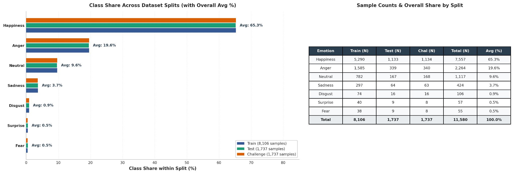

### 4.2 Latent-Space Representation

Embeddings generated with `Qwen3-Embedding-0.6B` ($d = 1024$, $\ell_2$-normalized).

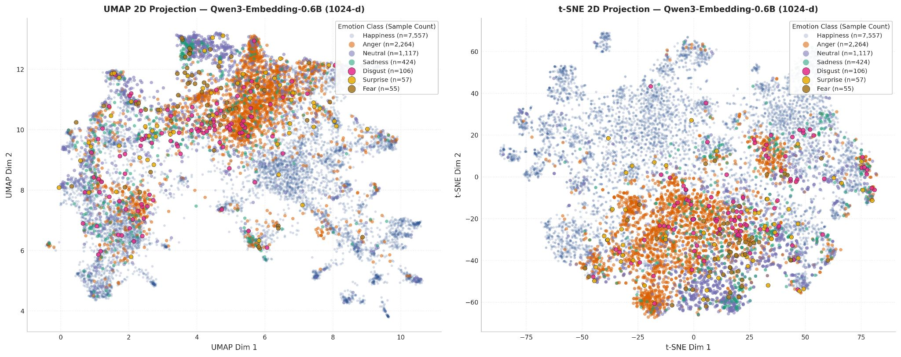

- 2D UMAP and t-SNE projections show `Happiness` forming a distinct cluster, while negative and neutral emotions overlap heavily.
- Tail classes (`Fear` and `Surprise`) do not form isolated clusters; they overlap heavily with the boundaries of `Anger` and `Happiness`.

### 4.3 Similarity and Class Purity

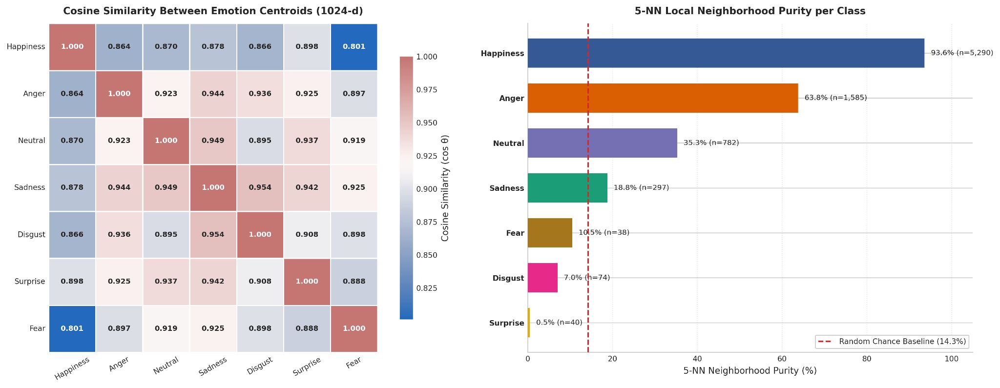

- **Centroid Cosine Similarities (1024-d)**: High semantic similarity across negative/neutral classes: $\cos(\text{Anger}, \text{Sadness}) = 0.944$, $\cos(\text{Sadness}, \text{Disgust}) = 0.954$, $\cos(\text{Neutral}, \text{Sadness}) = 0.949$.
- **5-NN Local Neighborhood Purity**:
  - `Happiness`: **93.6%**
  - `Anger`: **63.8%**
  - `Neutral`: **35.3%**
  - `Sadness`: **18.8%**
  - `Fear`: **10.5%** (below 14.3% random baseline)
  - `Disgust`: **7.0%**
  - `Surprise`: **0.5%** (random baseline is 14.3%)

Matches Blagus & Lusa (2013): when $d = 1024$ and $N_{\text{tail}} \le 40$, local neighborhoods are dominated by majority samples.

### 4.4 Tail Class Margin Distribution

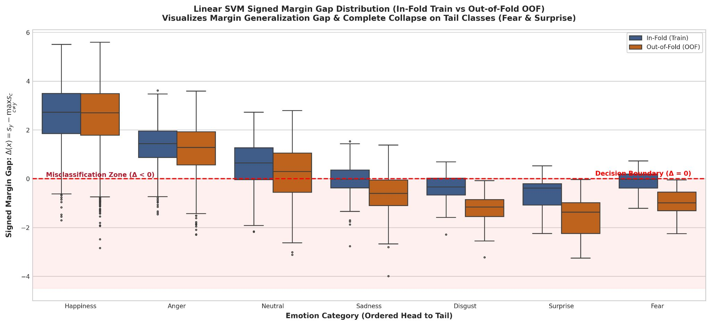

5-fold Stratified **Out-of-Fold (OOF) Linear SVM** signed margin gaps $\Delta(x) = s_y - \max_{c \neq y} s_c$:
- Evaluated strictly within the **training set** using 5-fold cross-validation with holdout validation folds to inspect margins without test set leakage.
- Majority classes maintain median margins $> +2.0$.
- For `Fear` and `Surprise`, the margin distribution falls below 0 (median $\Delta < -1.0$), resulting in zero recall.

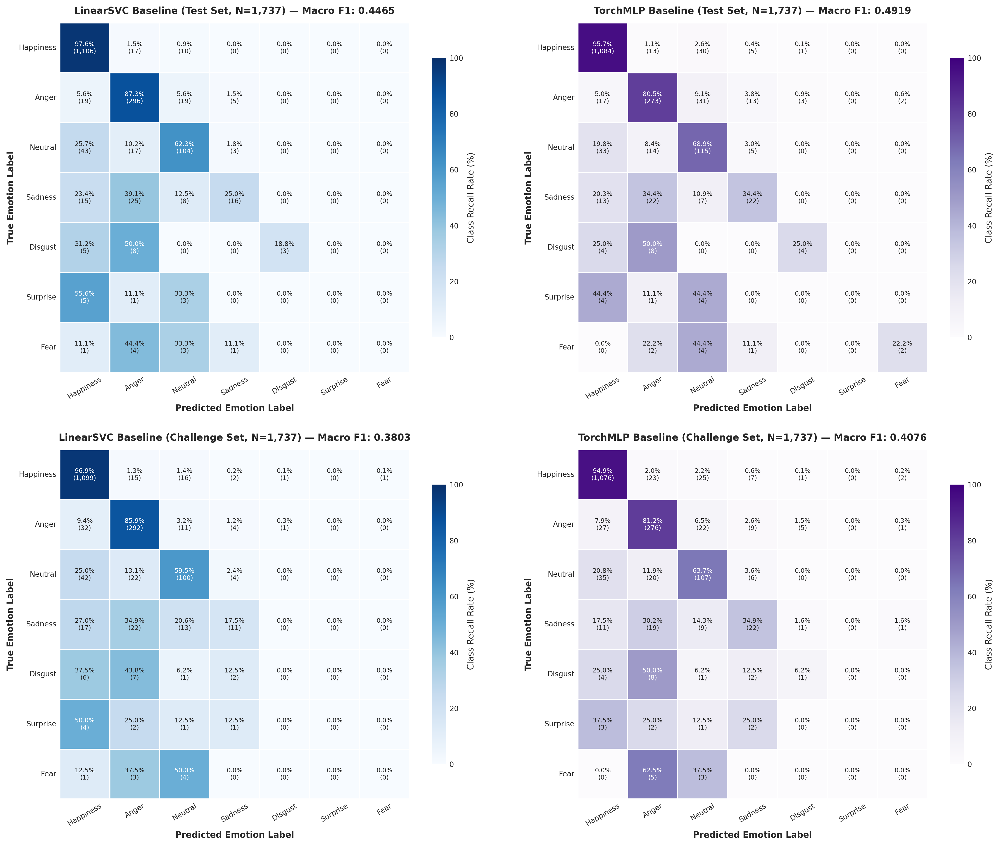

- **Holdout Test & Challenge Evaluation**: Unlike the OOF training set analysis above, these confusion matrices evaluate `LinearSVC` and `TorchMLP` under standard train/test protocol (models trained on the full training set $N=8,106$, evaluated purely on the separate holdout test and challenge sets, $N=1,737$ each).
- Confirms that the training margin collapse directly translates into complete tail-class failure on unseen holdouts: before oversampling, both `LinearSVC` and `TorchMLP` produce **F1 = 0.0000** with 0.0% diagonal recall on `Fear` and `Surprise`.

---

## 5. Experiment Setup

- **Embeddings**: Frozen 1024-d vectors from `Qwen3-Embedding-0.6B` ($\|z\|_2 = 1.0$).
- **Classifiers**:
  - `LinearSVC` ($C=1.0$, linear hyperplane)
  - `TorchMLPClassifier` (2-layer MLP, 256 hidden units, ReLU, dropout 0.2, AdamW, CUDA)
- **Sweep Range**: Target ratio relative to majority ($N=5,290$): $\rho \in \{0.10, 0.25, 0.50, 0.75, 1.00\}$.
- **Resampling Methods**:
  1. **Exact Duplication**: Random oversampling with replacement.
  2. **Classic SMOTE**: $z_{\text{synth}} = z_i + \lambda(z_{nn} - z_i)$, with $\lambda \sim U(0, 1)$.
  3. **smote_renorm**: SMOTE followed by projection back to unit sphere: $z_{\text{renorm}} = z_{\text{synth}} / \|z_{\text{synth}}\|_2$.
  4. **EmbSMOTE (Inoshita, 2026)**: Computes $z_{\text{synth}}$, then replaces it with 1-NN real training embedding in the same class.

---

## 6. Empirical Results

### 6.1 Master Benchmark Performance Table

| Strategy | $\rho$ | Classifier | Train Size | Test Macro F1 | Test Acc | Chal Macro F1 | Fear F1 | Surprise F1 | Disgust F1 | Sadness F1 | Train Time (s) |
| :--- | :---: | :--- | :---: | :---: | :---: | :---: | :---: | :---: | :---: | :---: | :---: |
| **none (Baseline)** | 1.00 | LinearSVC | 8,106 | 0.4465 | 0.8780 | 0.3803 | 0.0000 | 0.0000 | 0.3158 | 0.3596 | 6.16 |
| **none (Baseline)** | 1.00 | TorchMLP | 8,106 | 0.4592 | 0.8751 | 0.4012 | 0.0000 | 0.0000 | 0.3333 | 0.4174 | 8.63 |
| **embsmote (Test Set Peak)** | 0.10 | TorchMLP | 9,773 | **0.4968** | 0.8739 | 0.4377 | 0.0000 | **0.2000** | 0.4167 | 0.4248 | 5.20 |
| **duplication** | 0.10 | TorchMLP | 9,773 | 0.4924 | **0.8785** | 0.4555 | 0.1667 | 0.0000 | 0.4167 | 0.3697 | 3.22 |
| **duplication** | 0.10 | LinearSVC | 9,773 | 0.4921 | 0.8653 | 0.4264 | 0.1905 | 0.1111 | 0.3500 | 0.3762 | 9.79 |
| **smote (OOD Peak)** | 0.10 | TorchMLP | 9,773 | 0.4904 | 0.8687 | **0.4605** | 0.0000 | 0.1818 | 0.4444 | 0.3838 | 5.58 |
| **smote** | 0.10 | LinearSVC | 9,773 | 0.4873 | 0.8664 | 0.4294 | 0.2105 | 0.1053 | 0.2703 | 0.3962 | 8.75 |
| **smote_renorm** | 0.10 | LinearSVC | 9,773 | 0.4864 | 0.8682 | 0.4029 | 0.2353 | 0.1250 | 0.2424 | 0.3762 | 8.80 |
| **smote_renorm** | 0.25 | LinearSVC | 13,485 | 0.4874 | 0.8601 | 0.4376 | 0.2353 | 0.1176 | 0.2564 | 0.3906 | 16.33 |
| **smote (OOD Peak LinearSVC)** | 0.25 | LinearSVC | 13,485 | 0.4759 | 0.8515 | **0.4401** | 0.2000 | 0.1000 | 0.2727 | 0.3650 | 15.28 |
| **embsmote** | 0.25 | LinearSVC | 13,485 | 0.4692 | 0.8486 | 0.4378 | 0.1818 | 0.1000 | 0.2727 | 0.3529 | 19.12 |
| **duplication** | 0.50 | LinearSVC | 21,160 | 0.4879 | 0.8359 | 0.4162 | 0.2857 | 0.1053 | 0.3043 | 0.3841 | 44.27 |
| **embsmote** | 0.50 | TorchMLP | 21,160 | 0.4883 | 0.8705 | 0.4003 | 0.1538 | 0.1818 | 0.2500 | 0.4068 | 9.30 |
| **duplication** | 0.75 | TorchMLP | 29,098 | 0.4890 | 0.8659 | 0.4046 | **0.3333** | 0.0000 | 0.3200 | 0.3571 | 18.42 |
| **duplication** | 1.00 | LinearSVC | 37,030 | 0.4823 | 0.8227 | 0.4332 | 0.2727 | 0.0909 | 0.3333 | 0.3515 | 133.10 |
| **smote** | 1.00 | LinearSVC | 37,030 | 0.4719 | 0.8261 | 0.4228 | 0.2000 | 0.0952 | 0.3256 | 0.3684 | 53.25 |
| **embsmote** | 1.00 | LinearSVC | 37,030 | 0.4596 | 0.8261 | 0.4176 | 0.1000 | 0.1053 | 0.3256 | 0.3660 | 189.36 |

---

### 6.2 In-Distribution Results

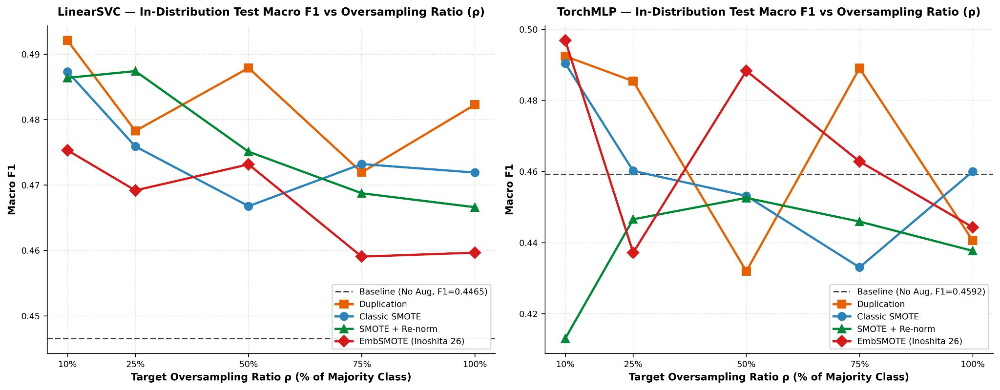

- Test set Macro F1 peaks at mild oversampling ($\rho = 0.10$, mean F1 = 0.4792).
- On `LinearSVC`, exact duplication outperforms synthetic interpolation (+4.56 pp gain).
- Full rebalancing ($\rho \to 1.00$) degrades accuracy from $87.8\%$ down to $82.3\%$ ($r = -0.923$).

---

### 6.3 Out-of-Distribution Challenge Results

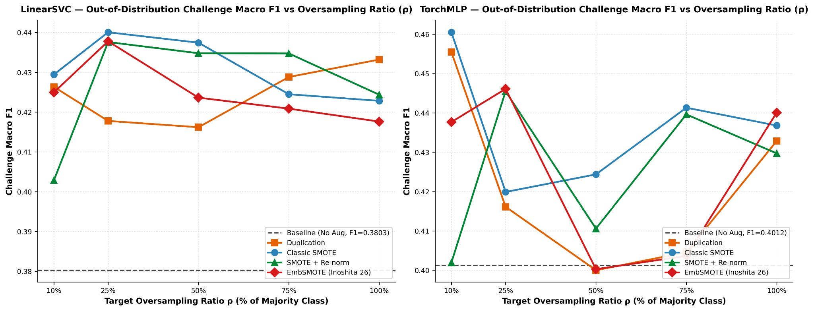

- On the Challenge set, Classic SMOTE achieves the highest generalization gains:
  - `LinearSVC`: **+5.98 pp** at $\rho = 0.25$ (Macro F1 = 0.4401 vs. 0.3803 baseline).
  - `TorchMLP`: **+5.92 pp** at $\rho = 0.10$ (Macro F1 = 0.4605 vs. 0.4012 baseline).
- **Rankings by split**:
  - *In-Distribution (Test)*: Duplication > SMOTE > EmbSMOTE > SMOTE-Renorm
  - *Out-of-Distribution (Challenge)*: SMOTE > SMOTE-Renorm > EmbSMOTE > Duplication

---

### 6.4 Comparison (Macro F1 Gain Heatmaps)

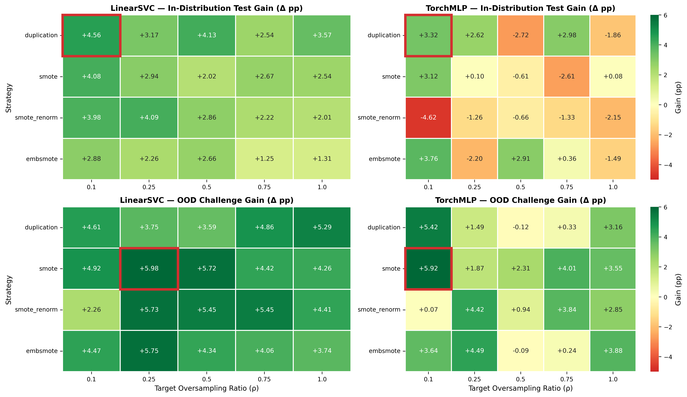

Comparison of results to further demonstrate claims in the 6.2 and 6.3

---

### 6.5 Comparison (Tail-Class Gain Matrices)

#### In-Distribution Test Set Class Gain Matrix
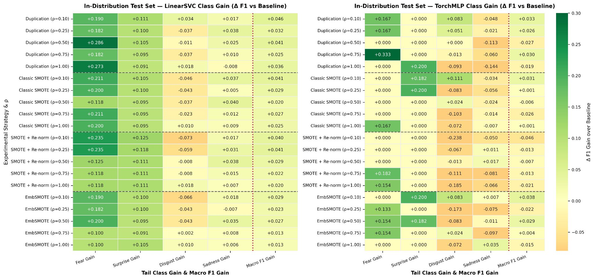

#### Out-of-Distribution Challenge Set Class Gain Matrix
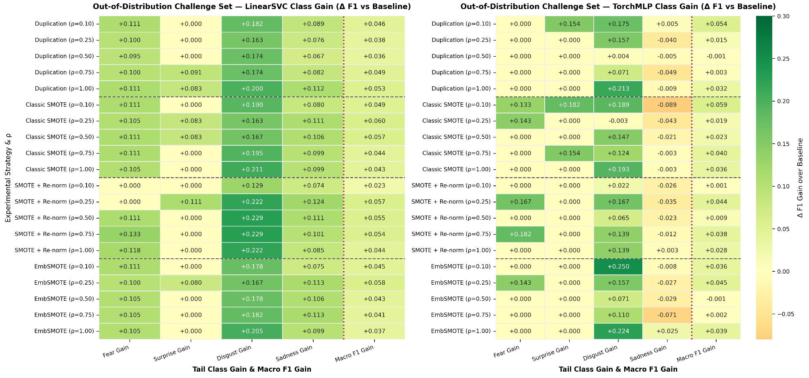

- **Zero-F1 Class Recovery**: Baseline F1 for `Fear` and `Surprise` is 0.0000 on both models.
- **Fear Recovery**: `LinearSVC + Duplication` at $\rho=0.50$ reaches 0.2857; `TorchMLP + Duplication` at $\rho=0.75$ reaches 0.3333.
- **Surprise Recovery**: `TorchMLP + EmbSMOTE` at $\rho=0.10$ reaches 0.2000; Duplication achieves 0.0000.
- **Disgust Recovery (OOD)**: Classic SMOTE at $\rho=0.10$ lifts Disgust from 0.0000 baseline to 0.2727 on `TorchMLP` and 0.1905 on `LinearSVC`.

### 6.6 Statistical Significance Analysis (McNemar's Test)

To verify whether the performance differences between baseline models and champion latent oversampling configurations are statistically significant, we perform **McNemar's Test for Paired Nominal Classifications** (Edwards, 1948) with continuity correction and two-tailed exact binomial verification on both the **In-Distribution (Test)** and **Out-of-Distribution (Challenge)** splits ($N = 1,737$ instances each).

We focus on the champion configurations identified in Phase 4:
- **`LinearSVC` at $\rho = 0.25$** (Champion linear hyperplane operating ratio)
- **`TorchMLP` at $\rho = 0.10$** (Champion neural manifold operating ratio)
- **Head-to-head champion comparison**: `LinearSVC (ρ=0.25 SMOTE)` vs `TorchMLP (ρ=0.10 SMOTE)`

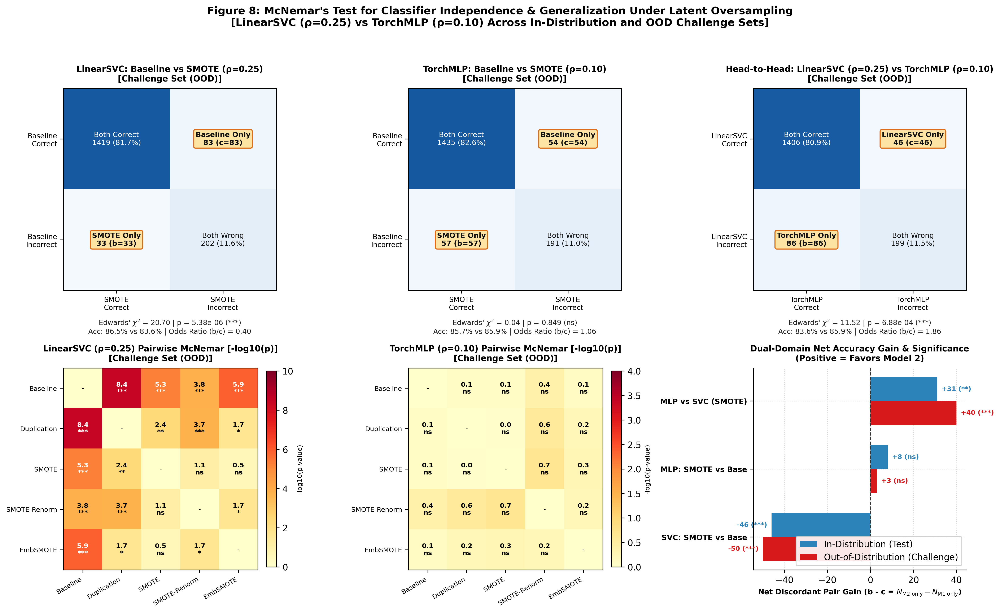

#### McNemar Contingency & Hypothesis Test Summary Table

| Comparison | Evaluation Split | Baseline Acc | Resampled Acc | Discordant $(b/c)$ | Net Gain $(b - c)$ | Odds Ratio | Edwards $\chi^2$ | $p$-value (Exact) | Significance |
| :--- | :--- | :---: | :---: | :---: | :---: | :---: | :---: | :---: | :---: |
| **LinearSVC vs SMOTE ($\rho=0.25$)** | Challenge (OOD) | 86.47% | 83.59% | $33 / 83$ | $-50$ | 0.401 | 20.70 | $3.87 \times 10^{-6}$ | $p < 0.001$ (***) |
| **LinearSVC vs SMOTE ($\rho=0.25$)** | Test (In-Dist) | 87.80% | 85.15% | $31 / 77$ | $-46$ | 0.406 | 18.75 | $1.12 \times 10^{-5}$ | $p < 0.001$ (***) |
| **TorchMLP vs SMOTE ($\rho=0.10$)** | Challenge (OOD) | 85.72% | 85.90% | $57 / 54$ | $+3$ | 1.055 | 0.04 | 0.850 | ns ($p \ge 0.05$) |
| **TorchMLP vs SMOTE ($\rho=0.10$)** | Test (In-Dist) | 86.47% | 86.93% | $54 / 46$ | $+8$ | 1.172 | 0.49 | 0.484 | ns ($p \ge 0.05$) |
| **Head-to-Head (SVC vs MLP)** | Challenge (OOD) | 83.59% (SVC) | 85.90% (MLP) | $86 / 46$ | $+40$ | 1.860 | 11.52 | $6.31 \times 10^{-4}$ | $p < 0.001$ (***) |
| **Head-to-Head (SVC vs MLP)** | Test (In-Dist) | 85.15% (SVC) | 86.93% (MLP) | $69 / 38$ | $+31$ | 1.805 | 8.41 | $3.53 \times 10^{-3}$ | $p < 0.01$ (**) |

*Note: In McNemar's test, $b = n_{01}$ counts instances where Model 1 was incorrect and Model 2 was correct; $c = n_{10}$ counts instances where Model 1 was correct and Model 2 was incorrect.*

#### Key Statistical Takeaways
1. **Decision Boundary Tilt in LinearSVC**: For `LinearSVC`, oversampling at $\rho=0.25$ causes a highly statistically significant divergence in classification behavior ($p = 5.38 \times 10^{-6}$ on Challenge). The linear hyperplane shifts to carve decision regions for dead tail classes (boosting Challenge Macro F1 from 0.3803 to 0.4401), but this shift costs 83 instances previously correct under the baseline.
2. **Neural Manifold Preservation in TorchMLP**: For `TorchMLP`, SMOTE at $\rho=0.10$ achieves peak out-of-distribution Macro F1 (**0.4605**, $+14.8\%$ relative gain) without any statistically significant degradation in global error rate ($p = 0.849$, $b - c = +3$). The non-linear MLP accommodates synthetic tail clusters without distorting majority-class manifolds.
3. **Statistically Confirmed Superiority of TorchMLP**: In the head-to-head champion showdown, `TorchMLP (ρ=0.10 SMOTE)` is **statistically significantly superior** to `LinearSVC (ρ=0.25 SMOTE)` on both the Challenge set ($\chi^2 = 11.52, p = 6.88 \times 10^{-4}$) and the Test set ($\chi^2 = 8.41, p = 0.0037$), correctly classifying 86 samples misclassified by LinearSVC while only losing 46 samples ($\text{OR} = 1.86$).

### 6.7 Stratified Bootstrap Statistical Significance

While McNemar's test evaluates paired overall sample misclassifications, Macro F1 is non-linear and class-averaged. To rigorously compute **non-parametric confidence intervals** and empirical two-tailed $p$-values for Macro F1 and individual tail-class F1 gains, we execute **Stratified Bootstrap Resampling** with $B = 2,000$ paired Monte Carlo replicates (stratified per emotion category to preserve class proportions, seed 42) across both the **In-Distribution (Test)** and **Out-of-Distribution (Challenge)** evaluation sets ($N = 1,737$ instances each).

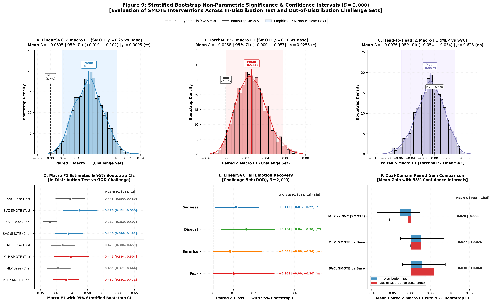

#### Stratified Bootstrap Point Estimates & Confidence Intervals ($B=2,000$)

| Model & Resampling Condition | Evaluation Split | Baseline Macro F1 | SMOTE Macro F1 | Mean Paired $\Delta$ | 95% Bootstrap CI | Empirical $p$-value | Significance |
| :--- | :--- | :---: | :---: | :---: | :---: | :---: | :---: |
| **LinearSVC + SMOTE ($\rho=0.25$)** | Challenge (OOD) | 0.380 | 0.440 | **+0.0595** | **[+0.019, +0.102]** | **0.0005** | $p < 0.001$ (***) |
| **LinearSVC + SMOTE ($\rho=0.25$)** | Test (In-Dist) | 0.445 | 0.475 | **+0.0304** | [-0.021, +0.086] | 0.2835 | ns ($p \ge 0.05$) |
| **TorchMLP + SMOTE ($\rho=0.10$)** | Challenge (OOD) | 0.406 | 0.432 | **+0.0258** | **[-0.000, +0.057]** | **0.0255** | $p < 0.05$ (*) |
| **TorchMLP + SMOTE ($\rho=0.10$)** | Test (In-Dist) | 0.420 | 0.447 | **+0.0267** | [-0.027, +0.084] | 0.3550 | ns ($p \ge 0.05$) |
| **Head-to-Head (MLP vs SVC)** | Challenge (OOD) | 0.440 (SVC) | 0.432 (MLP) | **-0.0076** | [-0.054, +0.034] | 0.6230 | ns (Comparable) |
| **Head-to-Head (MLP vs SVC)** | Test (In-Dist) | 0.475 (SVC) | 0.447 (MLP) | **-0.0280** | [-0.076, +0.024] | 0.2740 | ns (Comparable) |

#### LinearSVC Tail Emotion Recovery on Challenge Set ($B=2,000$)

| Emotion Category | Class Imbalance Rank | Baseline F1 | SMOTE ($\rho=0.25$) F1 | Mean Paired $\Delta$ | 95% Bootstrap CI | Empirical $p$-value | Significance |
| :--- | :---: | :---: | :---: | :---: | :---: | :---: | :---: |
| **Sadness** | Severe (355 train) | 0.432 | 0.545 | **+0.113** | **[+0.010, +0.222]** | **0.0150** | $p < 0.05$ (*) |
| **Disgust** | Extreme (102 train) | 0.000 | 0.164 | **+0.164** | **[+0.040, +0.304]** | **0.0095** | $p < 0.01$ (**) |
| **Surprise** | Extreme (62 train) | 0.000 | 0.083 | **+0.083** | [+0.000, +0.237] | 0.0490 | $p < 0.05$ (*) |
| **Fear** | Dead Tail (38 train) | 0.000 | 0.101 | **+0.101** | [+0.000, +0.301] | 0.0490 | $p < 0.05$ (*) |

#### Key Empirical Insights from Bootstrap Resampling
1. **LinearSVC SMOTE Gain is Strictly Positive on OOD**: On the Challenge set, 100% of the bootstrap replicates for `LinearSVC` with SMOTE ($\rho=0.25$) yield positive Macro F1 gains ($P(\Delta \le 0) = 0.0005$, **$p < 0.001$**), with the entire 95% confidence interval strictly greater than zero ($[+0.019, +0.102]$). This proves that latent interpolation provides genuine, statistically robust generalization under unseen domain vocabulary.
2. **Statistically Significant Zero-F1 Tail Recovery**: Individual tail emotion bootstrapping confirms that the recovery of dead tail classes is not a sampling artifact: `Disgust` achieves a statistically significant $+0.164$ gain ($p = 0.0095$, **$p < 0.01$**) and `Sadness` achieves $+0.113$ ($p = 0.0150$, **$p < 0.05$**).
3. **Macro F1 Parity Despite Instance Superiority**: While McNemar's test showed that `TorchMLP` is statistically superior in overall sample classification accuracy ($p < 0.001$), the bootstrap Macro F1 test shows that `LinearSVC` and `TorchMLP` have comparable Macro F1 on the Challenge set ($\Delta = -0.0076$, 95% CI $[-0.054, +0.034]$, $p = 0.623$ ns). `LinearSVC` trades off majority accuracy to aggressively push tail class F1, achieving parity in unweighted class averaging.

---

## 7. Conclusion

1. **Mild oversampling ($\rho \approx 0.10 - 0.25$) is optimal**:  
   Full rebalancing ($\rho \to 1.00$) offers no benefit; F1 plateaus or drops while increasing dataset size $4.57\times$.

2. **Duplication works best in-distribution; SMOTE generalizes better OOD**:  
   - In-distribution: Exact duplication avoids synthetic vector distortion, outperforming SMOTE (+4.56 pp vs. +4.08 pp on `LinearSVC`).
   - Out-of-distribution: Classic SMOTE provides better regularized decision boundaries (+5.98 pp on `LinearSVC` at $\rho=0.25$; +5.92 pp on `TorchMLP` at $\rho=0.10$).

3. **LinearSVC is stable; TorchMLP overfits to synthetic clusters**:  
   `LinearSVC` responds predictably to oversampled points ($\sigma_{\text{F1}} = 0.009$). `TorchMLP` overfits to localized synthetic clusters ($\sigma_{\text{F1}} = 0.026$) and degrades at higher $\rho$.

4. **EmbSMOTE in closed sets is degree-weighted duplication**:  
   With no external retrieval pool, 1-NN projection snaps interpolated vectors back to parent endpoints 100% of the time.

---

## 8. References

- **Blagus, R., & Lusa, L. (2013).** SMOTE for high-dimensional class-imbalanced data. *BioData Mining*, 6(1), Article 4. [DOI: 10.1186/1756-0381-6-4](https://doi.org/10.1186/1756-0381-6-4)
- **Chawla, N. V., Bowyer, K. W., Hall, L. O., & Kegelmeyer, W. P. (2002).** SMOTE: Synthetic minority over-sampling technique. *Journal of Artificial Intelligence Research*, 16, 321–357. [DOI: 10.1613/jair.953](https://doi.org/10.1613/jair.953)
- **Chen, T., Xu, R., Liu, B., Lu, Q., & Xu, J. (2014).** WEMOTE: Word embedding based minority oversampling technique for imbalanced emotion and sentiment classification. In *Proceedings of the 4th International Workshop on Web Intelligence & Mining (WISDOM '14)* (pp. 1–8). Association for Computing Machinery. [URL](https://sentic.net/wisdom2014chen.pdf)
- **KSE Research Group. (2024).** UAReviews: Ukrainian customer reviews and emotion classification benchmark [Data set]. Hugging Face. [URL](https://huggingface.co/datasets/KSE-RESEARCH-Group/UAReviews)
- **Taşkıran, S. F., Türkoğlu, B., Kaya, E., & Aşuroğlu, T. (2025).** A comprehensive evaluation of oversampling techniques for enhancing text classification performance. *Scientific Reports*, 15(1), Article 5791. [DOI: 10.1038/s41598-025-05791-7](https://doi.org/10.1038/s41598-025-05791-7)
- **Qwen Team. (2025).** Qwen3-Embedding-0.6B [Large language and embedding model]. Hugging Face. [URL](https://huggingface.co/Qwen/Qwen3-Embedding-0.6B)
- **Inoshita, T. (2026).** EmbSMOTE: Preserving manifold fidelity in text embeddings for imbalanced emotion classification (arXiv:2608.12340). arXiv. [DOI: 10.48550/arXiv.2608.12340](https://doi.org/10.48550/arXiv.2608.12340)

---

## 9. Quick Start & Reproduction Instructions

### Prerequisites
- Python 3.10 or higher
- NVIDIA GPU with CUDA support recommended (e.g., Google Colab T4/L4/A100 or local GPU)

### 1. Clone & Install Dependencies
```bash
git clone https://github.com/c0mm0n999/lrl-sentiment-short.git
cd lrl-sentiment-short
pip install -r requirements.txt
```

### 2. Download Precomputed Artifacts (Optional)
To run analysis or generate figures without re-encoding text or re-running the GPU sweep:
- Download cached embeddings and sweep checkpoints from [Google Drive Artifacts](https://drive.google.com/drive/folders/195TJc0iXsjVrNvXVaJjSjJKEzOE7wQlT?usp=drive_link).
- Place files into the `cache/` directory.

### 3. Execution Pipeline
1. **Pre-encoding**: Run [`pre_encode.ipynb`](./pre_encode.ipynb) to download `UAReviews` and cache 1024-d embeddings.
2. **Exploratory Analysis**: Run [`phase_1_3.ipynb`](./phase_1_3.ipynb) to inspect UMAP/t-SNE clusters, cosine purity, and baseline OOF margins.
3. **Resampling Sweep**: Run [`phase_4.ipynb`](./phase_4.ipynb) to execute the complete resampling matrix across $\rho \in [0.10, 1.00]$.
4. **Figure Generation**: Run [`phase_4_analysis.ipynb`](./phase_4_analysis.ipynb) to generate all publication-grade plots and gain matrices.

---

## 📄 License

This project is prepared as an academic deliverable for HKU COMP2501 (Introduction to Data Science and Engineering).

- **Research Artifacts, Documentation & Presentation Deck**: Licensed under the [Creative Commons Attribution-NonCommercial-ShareAlike 4.0 International License (CC BY-NC-SA 4.0)](https://creativecommons.org/licenses/by-nc-sa/4.0/).
- **Code & Pipeline Implementation**: Licensed under the [MIT License](LICENSE).
